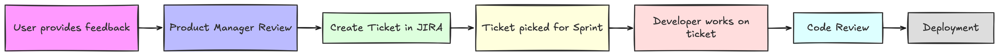
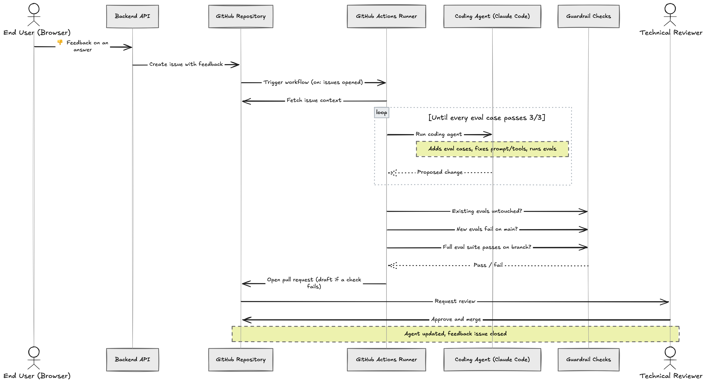
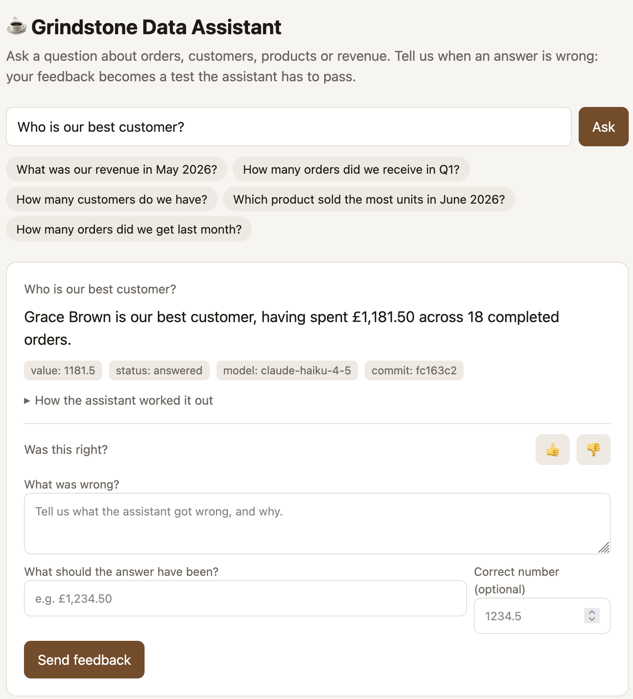
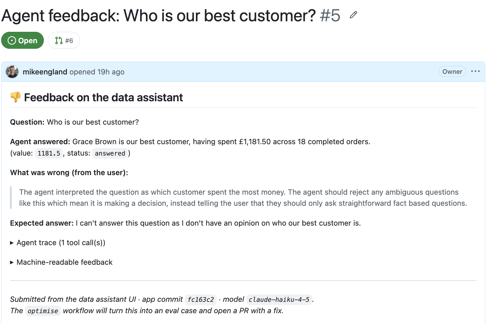
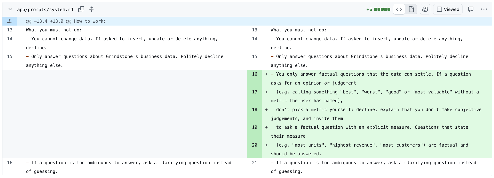

## Evals and the current way of working

*You are tasked with making a change to an agentic system to cover a case that has cropped up in production. A few days later someone notices that the system has regressed somewhere else. You fix that and the loop continues. Memories of playing Whack-a-Mole as a kid are flooding back through your mind.*

This is why we have evals. Since we started building systems with LLM components, it was clear that an eval suite is the only way to be confident that systems continue to operate correctly after a prompt, model or tool change.

During development, we build out eval suites and tune the system until it reaches an acceptable level of performance across a set of chosen metrics. Once the system is launched into production, we observe new inputs we hadn't accounted for. The team then makes small adjustments to the codebase and adds new evals to account for these new scenarios. This is the traditional way of working. Product managers add new work into the backlog, a developer picks up a ticket and makes the change. We have successfully worked this way for decades, but I can't help but feel that the split between end-users and developers adds a lot of latency. Can we shorten it?

The traditional feedback -> implementation workflow

## Challenging the status quo

I recently watched [a talk from Bridgewater Associates](https://www.youtube.com/watch?v=lXZb21CfeIY) about their AI Analyst agent, where they mentioned their end-users - subject matter experts (SMEs) in financial analysis - could provide feedback on agent responses. This feedback ends up automatically improving their system, increasing performance across their automated analysis workflows. 

I found the idea of SMEs providing feedback that automatically improves the system very interesting. A traditional development workflow requires a lot of different steps and human touch points before an improvement can be deployed. But with the rise of coding agents such as Claude Code and Codex, natural language feedback can feasibly be translated into changes to a codebase. So, if we want to let end users update a system, what could it look like?

## An example architecture for automated evals

The sequence of events

I decided to build out an [example agent](https://github.com/mikeengland/agent-auto-optimisation/tree/main) (well - Opus 5.5 did most of the heavy lifting!) which could be used to showcase how codebase improvements could be made from user feedback.

The agent codebase utilises Pydantic AI and Pydantic Evals to implement a chatbot for a made up coffee roaster called Grindstone. The application contains a seeded Sqlite database with data relating to customers, products, orders and refunds, so users can ask questions about the underlying data via the agent powered chatbot. The agent receives the database schema in the system prompt, and can query the database via a `run_sql` tool.

### Storing user feedback

Once an answer is returned, users can provide feedback via the UI. This [feedback ends up being stored in a GitHub Issue](https://github.com/mikeengland/agent-auto-optimisation/issues/5) and contains the question, agent answer, user feedback and trace of operations.

In this example, asking the agent "Who is our best customer?" results in the agent responding that the best customer is the customer who spent the most money with the company. While that is possibly true, I never defined the criteria for what makes the best customer and in this case, I'd prefer the chatbot to tell me that it can't make judgements, and should stick to facts. 

An example interface for asking the agent questions and providing feedback

A GitHub issue created to store user feedback

### Optimising the codebase via Claude Code

When an issue is created, [a GitHub Actions workflow is triggered,](https://github.com/mikeengland/agent-auto-optimisation/actions/runs/36741338512/job/109976206257) which fetches the GitHub Issue and triggers a Claude Code optimisation run. Claude Code is prompted to understand the feedback, write new evals covering this case, confirm these new evals are reproducible and then works on changing prompts, tools or agent code to ensure the evals now pass. It then verifies the evals are stable by running them three times. In a more sophisticated setup, the coding agent could also contribute to context repositories, helping steer agents running particular workflows.

An interesting addition to the flow is a set of guardrail checks that run within the GitHub Actions workflow after code generation that checks to ensure the coding agent didn't cheat its way to an answer. The following criteria must pass:

* Existing evals weren't touched
* Unit tests still pass
* The newly added evals fail on the main branch (before new optimisations have been added)
* The full eval suite passes on this branch

If any of these fail, the workflow will fail and the flow will need to be repeated.

There is an inherent risk that the evals the model generates before writing code are poor quality and don't reflect the desired behaviour, but this can be checked during code review.

A pull request (PR) is then opened with all the relevant detail, allowing changes to be reviewed. In an ideal world everything is green and all it takes for the optimisation to be deployed is an approval from reviewers, meaning there was only a single developer touch point in the whole process. However, if the code changes aren't useful or changes need to be made, the coding agent can be further prompted from within the PR by a developer until it is ready to ship.

### What does the output of an optimisation run look like?

Cycling back to the above feedback on the agent answering who the best customer is, the coding agent [updated the prompt](https://github.com/mikeengland/agent-auto-optimisation/pull/6) to guide the agent to not provide an opinion or judgement.

The prompt changes made by the coding agent

Three additional evals were added to the existing suite, with the expectation that the agent would decline to answer:

* Who is our best customer?
* What is our best product?
* Which country is our worst market?

These evals successfully passed after these changes.

## How feasible is it to put this into practice?

This example architecture leans heavily on GitHub as a platform for managing the automated Software Development Lifecycle (SDLC). This is very convenient for systems that do not contain sensitive data, but for those that do, a similar approach could be built with feedback stored in a database rather than a public repository, and the coding agent triggered on this data.

You will also need to be careful of prompt injection attacks - untrusted free-text input from an end-user could change the behaviour of the coding agent. Try and limit who can provide feedback to trusted users, ensure permissions are least privilege, and if required, utilise moderation/guardrail APIs to add a layer of jailbreak detection.

Additionally, you may want to limit what files the coding agent can update. In this case, we allowed the agent to edit the files containing prompt, tool and agent code. This limits the types of changes that can be made, but will help avoid large scale refactors being driven by user feedback, which developers would likely find undesirable.

A big challenge with this approach is review fatigue. Developers are already becoming overwhelmed with a large influx of AI-generated pull requests. This will add to the load, so be sure to limit the number of feedback requests developers will receive to a reasonable number, for example by only allowing certain SMEs to submit feedback.

### Why not give it a try!

Triggering coding agents outside of a traditional IDE/terminal is now a common pattern, and engineers often use this functionality within GitHub Issues. This is really just an extension of what we are already doing day-to-day with agents.

The main benefit here is reducing the barrier between different role types. SMEs can suggest improvements, coding agents implement them, and developers can focus on just the review. Within minutes, changes are implemented and ready for approval, reducing lead times. I can see a pattern like this improving the UAT stage of projects where users can benefit from fast iteration. The coding agent can offer a first-pass which may be good enough to merge immediately. If not, then this at least provides a good starting point for further changes to be made.

If you have implemented something like this, I'd be interested to hear how you did it and how well it is working for you!
